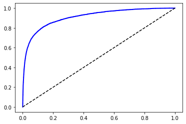
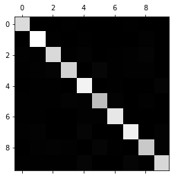
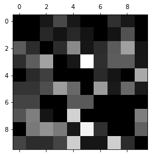

```python
from sklearn.datasets import fetch_openml  
from sklearn.linear_model import SGDClassifier
from sklearn.model_selection import cross_val_score
from sklearn.model_selection import cross_val_predict
from sklearn.base import BaseEstimator
from sklearn.metrics import confusion_matrix
from sklearn.metrics import precision_score, recall_score
from sklearn.metrics import f1_score
from sklearn.metrics import precision_recall_curve
from sklearn.metrics import roc_curve
from sklearn.metrics import roc_auc_score
from sklearn.ensemble import RandomForestClassifier
from sklearn.svm import SVC
from sklearn.multiclass import OneVsRestClassifier
from sklearn.preprocessing import StandardScaler
from sklearn.neighbors import KNeighborsClassifier
import matplotlib.pyplot as plt
import numpy as np
```


```python
from IPython.core.interactiveshell import InteractiveShell
InteractiveShell.ast_node_interactivity = "all"
```


```python
mnist = fetch_openml('mnist_784', version=1) # 사이킷런에서 mnist 데이터 불러오기 (dictionary)
mnist.keys() 
```


    dict_keys(['data', 'target', 'frame', 'categories', 'feature_names', 'target_names', 'DESCR', 'details', 'url'])


```python
X,y = mnist["data"], mnist["target"] # 70000개의 데이터 : X[i] = 28x28 손글씨 이미지, y[i] = 레이블
y = y.astype(np.uint8) # 문자열 형태 y를 정수로 변환
print("X : {0}".format(X.shape))
print("y : {0}".format(y.shape))
```

    X : (70000, 784)
    y : (70000,)
    


```python
some_digit = X[913]
some_label = y[913]
some_digit_image = some_digit.reshape(28,28) # X[12345]를 28x28 행렬로 재배열

plt.imshow(some_digit_image, cmap="binary")
plt.axis("off")
plt.show() # 이미지 출력
```


    (-0.5, 27.5, 27.5, -0.5)


```python
print("The answer is : {0}".format(some_label))
```

    The answer is : 8
    


```python
X_train, X_test, y_train, y_test = X[:60000], X[60000:], y[:60000], y[60000:] # train : test = 6 : 1
y_train_8, y_test_8 = (y_train==8), (y_test==8) # 이진 분류기를 먼저 만들어보자 [8 or ~8]
```


```python
sgd_clf = SGDClassifier(random_state=32) # Stochastic Gradient Descent Classifier을 모델로 사용
sgd_clf.fit(X_train, y_train_8) # 훈련(학습) 개시 (fit)
sgd_clf.predict([some_digit]) # 모델에 입력을 넣으면 결과가 출력된다. (predict)
```


    SGDClassifier(random_state=32)
    array([ True])


```python
cross_val_score(sgd_clf, X_train, y_train_8, cv=3, scoring="accuracy") # 3겹 교차검증 후 정확도 각각 체크
```


    array([0.9384, 0.9316, 0.9148])


```python
class Never8(BaseEstimator): # 무조건 8이 아니라고 하는 모델을 사용 
    def fit(self, X, y=None): # fit = 훈련 (학습안함)
        return self
    def predict(self, X): # predict = 예측 (무조건 false)
        return np.zeros((len(X),1),dtype=bool)
```


```python
never_8_clf = Never8()
cross_val_score(never_8_clf, X_train, y_train_8, cv=3, scoring="accuracy") # 3겹 교차검증 재실시
```


    array([0.9039 , 0.9031 , 0.90045])


```python
y_train_8_pred = cross_val_predict(sgd_clf, X_train, y_train_8, cv=3) # 3겹 교차검증 후 predict 저장
confusion_matrix(y_train_8, y_train_8_pred) # predict와 label로 오차행렬 생성 (TN,FP,FN,TP)
confusion_matrix(y_train_8, y_train_8) # 만약 predict가 100% 정확할 경우 
```


    array([[51981,  2168],
           [ 2136,  3715]], dtype=int64)
    array([[54149,     0],
           [    0,  5851]], dtype=int64)


```python
precision_score(y_train_8, y_train_8_pred) # precision = True라고 예측한 것중 True 비율 = 63.1%
recall_score(y_train_8, y_train_8_pred) # recall = True 중 True라고 예측한 비율 = 63.4%
f1_score(y_train_8, y_train_8_pred) # F1 = 두 점수의 조화평균, 임계값에 따른 모델의 성능 제시
```


    0.6314805371409145
    0.634934199282174
    0.633202658939833


```python
y_scores = cross_val_predict(sgd_clf, X_train, y_train_8, cv=3, method="decision_function") # 3겹 교차검증 후 score 저장
precisions, recalls, thresholds = precision_recall_curve(y_train_8, y_scores) # PR곡선 구하기 [recall x precision]
```


```python
def plot_pr_threshold_curve(precisions, recalls, thresholds):
    plt.plot(thresholds, precisions[:-1], "b-", label="precision")
    plt.plot(thresholds, recalls[:-1], "g-", label="recall")
    f1_scores = 2/(1/precisions + 1/recalls)
    plt.plot(thresholds, f1_scores[:-1], "k-", label="F1")
def plot_pr_curve(precisions, recalls):
    plt.plot(recalls[:-1], precisions[:-1], "g-", label="PR")
```


```python
plot_pr_threshold_curve(precisions, recalls, thresholds)
plt.show() # precision과 recall은 임계값에 대해 대립 관계라는 것을 알 수 있음 
plot_pr_curve(precisions, recalls)
plt.show() # PR곡선 = x축이 recall, y축이 precision
```

    <ipython-input-16-110da288e4d8>:4: RuntimeWarning: divide by zero encountered in true_divide
      f1_scores = 2/(1/precisions + 1/recalls)
    


```python
threshold_90p = thresholds[np.argmax(precisions >= 0.90)]
y_train_pred_90p = (y_scores >= threshold_90p) # predict는 score과 threshold의 비교로 얻어낼 수 있음
precision_score(y_train_8, y_train_pred_90p)
recall_score(y_train_8, y_train_pred_90p) # precision은 90% 이상인 반면, recall은 낮게 나옴
```


    0.9005649717514125
    0.1362160314476158


```python
FPR, TPR, thresholds = roc_curve(y_train_8, y_scores) # ROC곡선 구하기 [FP_rate x TP_rate] 
```


```python
def plot_roc_curve(FPR, TPR, label=None, color="blue"):
    plt.plot(FPR, TPR, color=color, linewidth=2, label=label)
    plt.plot([0,1],[0,1],'k--')
plot_roc_curve(FPR,TPR) # FP_rate = False 중 True라고 예측, TP = True 중 True라고 예측한 비율
plt.show() # ROC곡선 = x축이 FP_rate, y축이 TP_rate
```





```python
forest_clf = RandomForestClassifier(random_state=42) # Random Forest Classifier을 모델로 사용
y_probas_forest = cross_val_predict(forest_clf, X_train, y_train_8, cv=3, method="predict_proba") # 3겹 교차검증 후 probability 저장[0~1]
```


```python
y_scores_forest = y_probas_forest[:,1] # Forest가 만든 확률배열 중 Tree 하나를 골라서 점수로 사용
FPR_forest, TPR_forest, thresholds_forest = roc_curve(y_train_8, y_scores_forest) # ROC곡선 구하기 (SGD와 동일)
```


```python
plot_roc_curve(FPR_forest, TPR_forest, "Random Forest", "blue") 
plot_roc_curve(FPR, TPR, "SGD", "green") 
plt.show() # Random Forest와 SGD의 두 ROC곡선 비교
roc_auc_score(y_train_8, y_scores) 
roc_auc_score(y_train_8, y_scores_forest) # 두 ROC곡선의 AUC 비교
```


    0.9105237007545589
    0.9965481456893603


```python
X_train_small = X_train[1:4000] # SVM은 시간복잡도가 많이 나가기 때문
y_train_small = y_train[1:4000]
```


```python
svm_clf = SVC() # Support Vector Machine Classfier을 모델로 사용 (다중 클래스 분류과제)
svm_clf.fit(X_train_small, y_train_small) # fit
svm_clf.predict([some_digit]) # predict 
cross_val_score(svm_clf, X_train_small, y_train_small, cv=3, scoring="accuracy") # 3겹 교차검증 후 정확도 체크 (SVM)
```


    SVC()
    array([8], dtype=uint8)
    array([0.92573143, 0.95273818, 0.94523631])


```python
svm_clf.classes_ # 모델이 분류하는 레이블의 목록
some_digit_scores = svm_clf.decision_function([some_digit]) # 하나의 샘플에 10가지 score이 저장됨
some_digit_scores
np.argmax(some_digit_scores) # 10가지 score 중 최대값을 가지는 index
```


    array([0, 1, 2, 3, 4, 5, 6, 7, 8, 9], dtype=uint8)
    array([[ 3.84154229, -0.27526145,  8.18636682,  4.87562896,  2.76458353,
             7.18364473,  1.74813123,  0.72775562,  9.30745486,  6.21505412]])
    8


```python
sgd_clf.fit(X_train, y_train) # fit - SGD도 다중 클래스 분류에 사용가능
sgd_clf.predict([some_digit]) # predict
cross_val_score(sgd_clf, X_train, y_train, cv=3, scoring="accuracy") # 3겹 교차검증 후 정확도 각각 체크 (SGD)
```


    SGDClassifier(random_state=32)
    array([8], dtype=uint8)
    array([0.85365, 0.85045, 0.8831 ])


```python
scaler = StandardScaler() # SGD팁 - 입력 데이터의 분포를 스케일링함 
X_train_scaled = scaler.fit_transform(X_train.astype(np.float64))
cross_val_score(sgd_clf, X_train_scaled, y_train, cv=3, scoring="accuracy") # 교차검증 시 정확도 향상 확인 가능
```


    array([0.8993 , 0.88925, 0.90845])


```python
y_svm_train_pred = cross_val_predict(svm_clf, X_train_small, y_train_small, cv=3) # SVM 3겹 교차검증 후 predict 저장
svm_conf_mx = confusion_matrix(y_train_small, y_svm_train_pred) # predict와 label로 오차행렬 생성
svm_conf_mx # 다중분류의 오차행렬(가로 predict / 세로 label)
plt.matshow(svm_conf_mx, cmap=plt.cm.gray) # 대각선 위치가 밝아야 분류가 잘된것
```


    array([[371,   0,   1,   3,   1,   0,   0,   2,   1,   0],
           [  0, 433,   2,   1,   2,   1,   0,   1,   4,   0],
           [  4,   2, 368,   2,   6,   1,   2,   4,   7,   1],
           [  2,   4,   7, 356,   1,  11,   2,   4,   4,   1],
           [  0,   2,   3,   0, 414,   0,   2,   1,   0,   8],
           [  2,   2,   3,   6,   4, 320,   6,   1,   4,   1],
           [  3,   3,   0,   0,   4,   4, 391,   0,   0,   0],
           [  4,   6,   1,   0,  10,   0,   0, 406,   0,   6],
           [  0,   5,   6,   5,   1,  10,   2,   0, 340,   4],
           [  3,   2,   2,   3,   9,   1,   1,   9,   2, 365]], dtype=int64)





```python
temp = svm_conf_mx / svm_conf_mx.sum(axis=1, keepdims=True) # Normalize
np.fill_diagonal(temp, 0) # 대각선 영역 제거
plt.matshow(temp, cmap=plt.cm.gray) # 어디에서 오차가 심한지 확인 가능 (4-9,7-9,3-5)
```





```python
y_train_pred = cross_val_predict(sgd_clf, X_train, y_train, cv=3) # SGD로 같은 과정 반복
conf_mx = confusion_matrix(y_train, y_train_pred)
conf_mx 
plt.matshow(conf_mx, cmap=plt.cm.gray)
```


    array([[5607,    1,   30,   21,    7,   56,   67,    6,  119,    9],
           [   2, 6384,   46,   39,    8,   40,   19,   17,  166,   21],
           [  46,   59, 4910,  152,   55,   29,  177,  105,  400,   25],
           [  21,   18,  195, 5013,   10,  362,   38,  102,  274,   98],
           [  27,   20,   36,   52, 4684,   44,  111,   25,  244,  599],
           [  65,   18,   34,  275,   76, 4246,  161,   32,  408,  106],
           [  37,    7,   30,   12,   34,   62, 5651,    3,   79,    3],
           [  23,   13,   38,   44,   66,   14,    7, 5660,  100,  300],
           [  35,  101,   75,  211,   56,  172,   56,   33, 4999,  113],
           [  27,   12,   17,  118,  379,   90,    6,  471,  239, 4590]],
          dtype=int64)


```python
temp = conf_mx / conf_mx.sum(axis=1, keepdims=True) # Normalize
np.fill_diagonal(temp, 0) # 대각선 영역 제거
plt.matshow(temp, cmap=plt.cm.gray) # 어디에서 오차가 심한지 확인 가능 
```


```python
X_97 = X_train[(y_train == 9) & (y_train_pred == 7)]
X_79 = X_train[(y_train == 7) & (y_train_pred == 9)]
X_49 = X_train[(y_train == 4) & (y_train_pred == 9)]
X_94 = X_train[(y_train == 9) & (y_train_pred == 4)]
```


```python
import matplotlib.cm
def plot_digits(instances, images_per_row=10, **options): # 이미지 그리는 함수
    size = 28
    images_per_row = min(len(instances), images_per_row)
    images = [instance.reshape(size,size) for instance in instances]
    n_rows = (len(instances) - 1) // images_per_row + 1
    row_images = []
    n_empty = n_rows * images_per_row - len(instances)
    images.append(np.zeros((size, size * n_empty)))
    for row in range(n_rows):
        rimages = images[row * images_per_row : (row + 1) * images_per_row]
        row_images.append(np.concatenate(rimages, axis=1))
    image = np.concatenate(row_images, axis=0)
    plt.imshow(image, cmap = matplotlib.cm.binary, **options)
    plt.axis("off")
```


```python
plt.figure(figsize=(8,8)) # 오답노트 출력하기
plt.subplot(221); plot_digits(X_97[:25], images_per_row=5) 
plt.subplot(222); plot_digits(X_79[:25], images_per_row=5)
plt.subplot(223); plot_digits(X_49[:25], images_per_row=5)
plt.subplot(224); plot_digits(X_94[:25], images_per_row=5)
```


```python
y_train_large = (y_train >= 7) # 7이상
y_train_odd = (y_train%2 == 1) # 홀수
y_multilabel = np.c_[y_train_large, y_train_odd] # "다중 레이블 분류과제" - 예측해야 하는 항목 2개
```


```python
knn_clf = KNeighborsClassifier() # K-Neighbors Classifier을 모델로 사용
knn_clf.fit(X_train, y_multilabel) # fit
knn_clf.predict([some_digit]) # predict(8)
```


    KNeighborsClassifier()
    array([[ True, False]])


```python
y_knn_train_pred = cross_val_predict(knn_clf, X_train, y_multilabel, cv=3) # KNN 3겹 교차검증 후 predict 저장
f1_score(y_multilabel, y_knn_train_pred, average="macro") # predict와 label로 F1 계산
```


    0.976410265560605


```python
noise = np.random.randint(0, 100, (len(X_train), 784))
X_train_noise = X_train + noise
noise = np.random.randint(0, 100, (len(X_test), 784)) 
X_test_noise = X_test + noise 
```


```python
knn_clf.fit(X_train_noise, X_train) # "다중 출력 분류과제" - 사진 노이즈 제거
clean_digit = knn_clf.predict([X_test_noise[8293]])
plot_digits(clean_digit)
```


